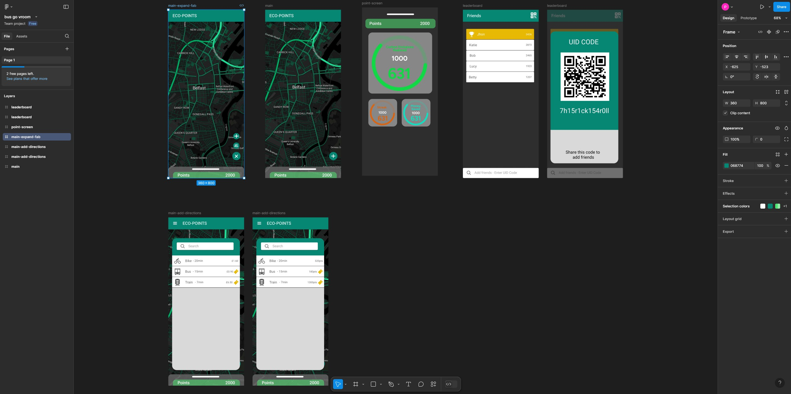

### Eco Points - Frontend  

**GitHub Repository:** [Eco Points - Frontend](https://github.com/SesifredoDev/eco-points-frontend)  

---

#### Project Overview  

**Eco Points** is a web application designed to encourage sustainable living by rewarding eco-friendly actions. This project leverages modern web technologies to create an intuitive and visually appealing platform where users can track their ecological impact, earn points, and redeem rewards.  

The development process was guided by a **Figma design**, ensuring a user-centric and clean interface.  

  

---

#### Main Features  

- **Interactive User Dashboard**: Displays eco-points, achievements, and progress toward rewards.  
- **Gamified User Experience**: Encourages eco-friendly actions with badges and point-based incentives.  
- **Seamless Navigation**: Smooth transitions between tracking activities, viewing rewards, and redeeming points.  
- **Responsive Design**: Fully functional on both desktop and mobile devices.  

---

#### Main Packages and Tools  

The frontend of **Eco Points** was built using the following technologies and libraries:  

- **Angular Framework**: Powers the core structure and dynamic data handling of the application.  
- **Ionic Framework**: Ensures cross-platform compatibility and enhances the mobile-first design approach.  
- **Figma**: Used to create the design prototype, which guided the development of a cohesive and visually appealing user interface.  
- **TypeScript and SCSS**: Enables scalable, maintainable, and modular code for both functionality and styling.  
- **Git for Version Control**: Managed project iterations and team collaboration effectively.  

---

#### Challenges and Iterations  

The development of **Eco Points** required solving several challenges:  

1. **Design to Code Implementation**:  
   - Translating the **Figma design** into a fully functional and responsive web interface.  

2. **Gamification Integration**:  
   - Designing a system to track user actions and assign corresponding points and rewards.  

3. **Optimizing User Experience**:  
   - Ensuring smooth navigation and quick load times across devices.  

4. **Testing and Feedback Cycles**:  
   - Incorporating user feedback to refine layouts, improve usability, and enhance performance.  

---

#### Purpose and Impact  

**Eco Points** was built to inspire sustainable behavior through engaging and rewarding experiences. By combining gamification with a clean, user-friendly interface, this project aims to make eco-conscious living more accessible and fun.  

---

**Repository Link**: [GitHub](https://github.com/SesifredoDev/eco-points-frontend)